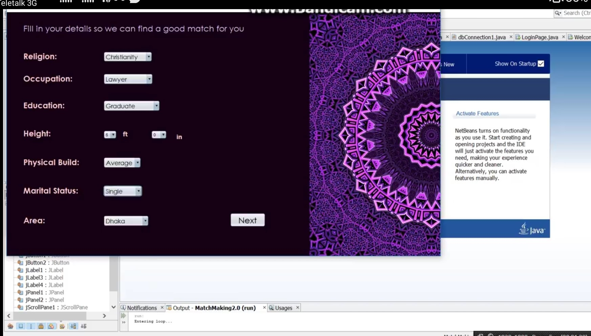

# MatchMaking
### 2nd year 1st semester's Software Development(Netbeans)
It was a matrimonial platform where individuals could get suggested candidates according to their likes and dislikes.
Platform: Java Swing, Language: Java

An image of the project is shown below.  

Demonstration of Registration of the software is given <a href="https://youtu.be/eX7Fov6aiaI">Here</a>. 
A short Demonstration of finding a match using this software is provided <a href="https://youtu.be/mjgzCJ6bTAg">Here</a>.

